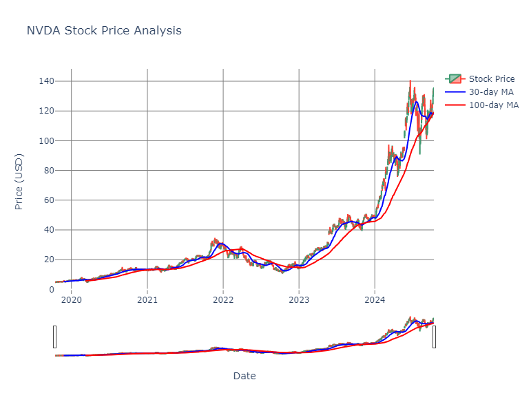
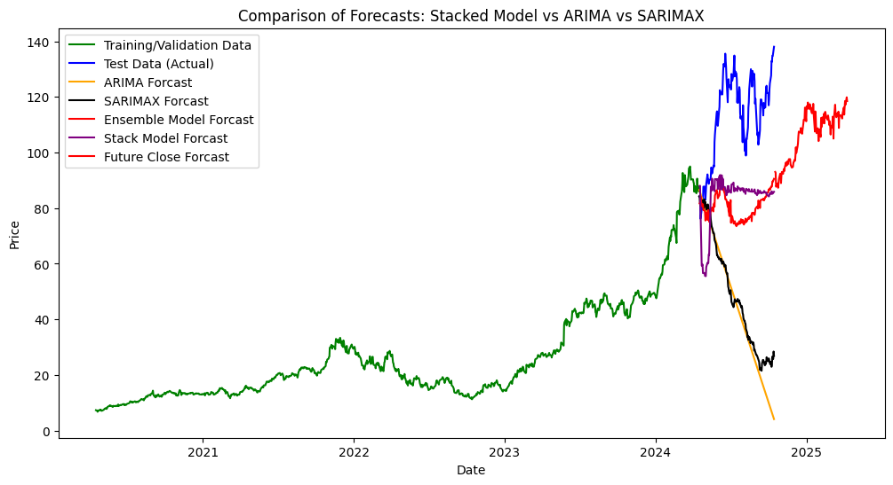
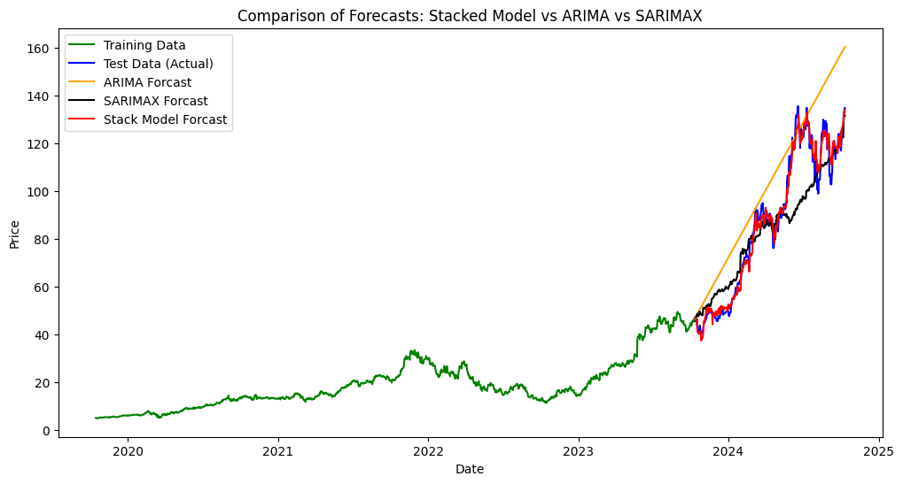

# NVIDIA Stock Price Analysis and Forecasting

## Project Introduction
**Author:** Qiaoying (Annie) Zhang

This project focuses on building a comprehensive end-to-end solution to analyze and forecast the stock price of NVIDIA (NVDA), combining ETL pipelines, time series analysis, interactive visualizations, and advanced machine learning techniques. The goal is to accurately predict NVIDIA’s stock price while comparing traditional time series models with deep learning and ensemble-based approaches to ensure high accuracy and robustness.

*The stock price data is sourced from the public API - Yahoo Finance (5 years of NVDA data)*

*Data Preview:*
| Date       | Open       | High       | Low        | Close      | Adj Close  | Volume      |
|------------|------------|------------|------------|------------|------------|-------------|
| 2019-10-15 | 4.754000   | 4.982250   | 4.740000   | 4.909250   | 4.885488   | 664124000   |
| 2019-10-16 | 4.875000   | 4.980500   | 4.843750   | 4.855250   | 4.831748   | 428944000   |
| 2019-10-17 | 4.900000   | 4.945250   | 4.802500   | 4.857250   | 4.833740   | 263436000   |
| 2019-10-18 | 4.857750   | 4.890500   | 4.687500   | 4.762250   | 4.739199   | 307440000   |
| 2019-10-21 | 4.824000   | 4.913750   | 4.805000   | 4.900250   | 4.876531   | 261868000   |



**[Updated Version](https://github.com/QiaoyingZhang/Data-Science-Projects/blob/main/NVIDIA%20Stock%20Price%20Analysis%20and%20Forecasting/NVDA_stock_forcast_v2.ipynb):**
The updated version of the prediction model has been designed to forecast the market's closing prices for the upcoming half-year by employing an ensemble approach that combines the strengths of multiple algorithms. This model utilizes a weighted average of predictions from a Feedforward Neural Network (FNN), XGBoost, and CatBoost, ensuring robust and accurate outcomes. To enhance predictive performance, the model incorporates lagged data from the past six months, drawing from a comprehensive dataset spanning 3.2 years for training and 0.8 years for validation. This structured methodology not only leverages the unique capabilities of each individual model but also provides a more reliable and nuanced understanding of market dynamics, enabling better investment decisions in an ever-evolving financial landscape.



*Model Performance Evaluations*
| Model      | MSE         | MAE        | R² Score   |
|------------|-------------|------------|------------|
| ARIMA      | 5891.862125 | 68.409926  | -23.792335 |
| SARIMAX    | 5263.850681 | 65.192165  | -21.149729 |
| Ensemble   | 1308.480368 | 33.035355  | -4.542774  |
| Stack      | 1036.903187 | 30.147013  | -3.392363  |

*Although the Stack model demonstrates a relatively lower mean squared error (MSE) and a higher R² score, indicating better performance on the training data, the Ensemble model exhibits greater variance in its predictions. This characteristic makes the Ensemble model particularly valuable for forecasting future data based on the previous half-year's worth of data. To achieve these results, extensive feature engineering has been performed, enhancing the model's ability to capture underlying trends and patterns in the data. **The results indicate an upward trend in the future market.***

**Feature Engineering**
- **Moving_Avg_30**: The 30-day simple moving average, used to smooth out price data and identify trends over a one-month period.
- **Moving_Avg_100**: The 100-day simple moving average, which provides a longer-term view of price trends and helps filter out short-term fluctuations.
- **Year**: Represents the calendar year in which the data is recorded, often used for seasonal analysis.
- **Month**: Indicates the specific month of the year, useful for monthly trend assessments.
- **Day**: Refers to the individual day within a month, important for daily trading analysis.
- **DayOfWeek**: The specific day of the week (e.g., Monday, Tuesday) to analyze weekly trends and patterns.
- **EMA_12**: The 12-day exponential moving average, giving more weight to recent prices to capture short-term trends more responsively.
- **EMA_26**: The 26-day exponential moving average, used in conjunction with the EMA_12 to calculate the MACD.
- **SMA_5**: The 5-day simple moving average, providing insight into very short-term price movements.
- **SMA_20**: The 20-day simple moving average, balancing short-term price movements with slightly longer-term trends.
- **Volatility_20**: A measure of price fluctuations over a 20-day period, indicating the degree of variability in the stock's price.
- **MACD**: A momentum indicator that shows the relationship between two moving averages of a security's price, used for identifying trends and reversals.
- **Upper_band**: The upper boundary of a Bollinger Band, representing a resistance level, calculated by adding a specified number of standard deviations to the moving average.
- **Lower_band**: The lower boundary of a Bollinger Band, indicating a support level, calculated by subtracting a specified number of standard deviations from the moving average.
- **Daily_Return**: The percentage change in price from one trading day to the next, providing insights into daily performance.
- **Cumulative_Return**: The total return of an investment over a specified period, calculated by compounding daily returns.
- **Range**: The difference between the highest and lowest prices in a trading period, indicating market volatility.
- **Close_Open_Diff**: The difference between the closing price of the previous day and the opening price of the current day, highlighting overnight price changes.
- **RSI**: A momentum oscillator that measures the speed and change of price movements, used to identify overbought or oversold conditions in a market.

### Time Series Analysis: ARIMA to SARIMAX
To forecast future stock prices, the analysis first employs time series models, specifically ARIMA (Auto-Regressive Integrated Moving Average). The order and seasonal order of the model are optimized using metrics like AIC and diagnostics such as residual analysis to ensure stationarity and minimize autocorrelation. However, the presence of seasonal trends and exogenous factors, such as earnings reports or macroeconomic events, makes ARIMA limited in scope. To address these, the analysis extends to SARIMAX (Seasonal ARIMA with Exogenous Variables), which can model both seasonality and external influences, thus improving the accuracy of predictions.

### Machine Learning and Deep Learning Approaches
While time series models provide solid baselines, the project goes beyond with machine learning and deep learning models to capture non-linear relationships and complex patterns within the data:

- **Keras-based Neural Networks**: These are trained with dropout and early stopping to capture non-linear trends and reduce overfitting, allowing the model to generalize well to unseen data. This approach is particularly useful in scenarios where the stock exhibits high volatility.
  
- **XGBoost Regressor**: Selected for its ability to handle feature interactions efficiently through gradient boosting, it excels in datasets with multiple input features, including engineered ones like volatility indices or technical indicators, giving a more refined prediction.

- **Stacked Ensemble Models**: Developed by combining the outputs of individual models (e.g., SARIMAX, XGBoost, and neural networks) using a meta-learner. This ensemble strategy leverages the strengths of each model, balancing the precision of statistical models with the adaptability of machine learning.

### Rationale for Chosen Approaches
- **Statistical Models (ARIMA, SARIMAX)**: These are utilized for their interpretability and ability to handle time series data effectively, particularly with seasonal patterns.
  
- **Deep Learning Models (Keras)**: Integrated to account for complex, non-linear dependencies that are difficult for traditional time series models to capture.

- **XGBoost**: Offers robust performance with structured data, leveraging boosting techniques to improve predictions iteratively.

- **Stacked Ensembles**: Provide a powerful way to combine predictions from multiple models, minimizing errors and producing more accurate results than individual models alone.

By employing a combination of time series models, machine learning models, and ensemble techniques, this project ensures that both short-term fluctuations and long-term trends are captured accurately, ultimately aiming to outperform baseline statistical forecasts.



## Requirements
- Python 3.x
- Libraries: Pandas, NumPy, scikit-learn, statsmodels, Keras, XGBoost, Plotly, etc.

## Installation
```bash
pip install -r requirements.txt
